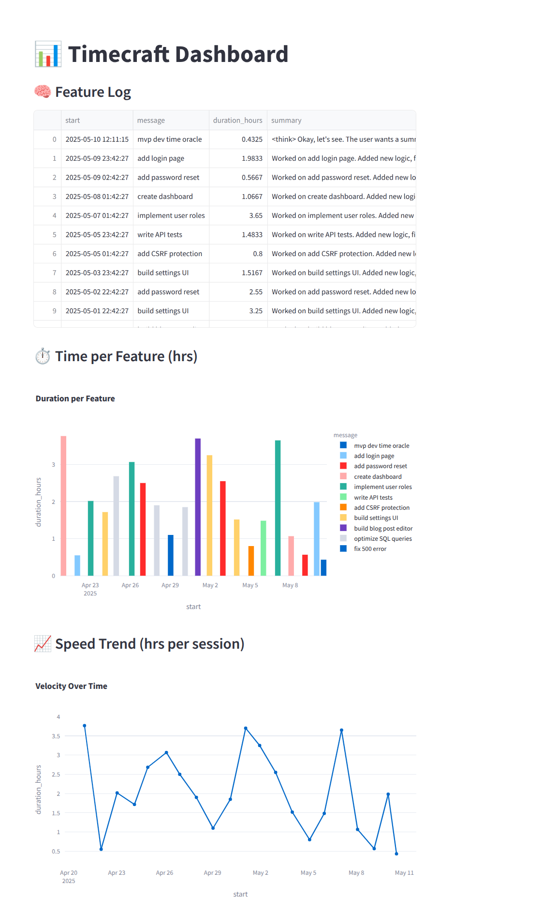

#  CodeChrono helps you estimate how long software tasks will take — based on how long you actually take to build them.

A local LLM-powered dev session logger that watches your terminal, code changes, and app focus — then summarizes what you worked on.

Built to help you estimate how long real work takes—based on your own history, not guesswork.

---

## 🚀 Features

- ✅ Tracks terminal commands and app focus
- ✅ Summarizes git diffs
- ✅ Uses a local LLM (via [Ollama](https://ollama.com)) to generate summaries
- ✅ Stores everything locally in SQLite
- ✅ **Estimates time to complete new tasks based on your real history**
- ✅ Fully offline, no tracking

---
## 📊 Your Dev Work — Visualized

See what you worked on, how long it took, and whether you’re speeding up — all in a clean local dashboard.



---

## 📦 Requirements

- Python 3.8+
- [Ollama](https://ollama.com) installed and running a model (e.g. `mistral`)
- Shell that supports `PROMPT_COMMAND` (bash, zsh)
- App focus tracking (optional):
  - `xdotool` for Linux
  - `osascript` for macOS (basic support via AppleScript)
  - [NirCmd](https://www.nirsoft.net/utils/nircmd.html) or custom PowerShell for Windows


---

## 📥 Setup

1. **Clone this repo**

2. **Install Python dependencies**
   ```bash
   pip install -r requirements.txt
   ```

3. **Set up terminal logging and run ollama**
   ```bash
   bash scripts/setup_terminal_logger.sh
   source ~/.bashrc   # or source ~/.zshrc

   ollama run qwen3:14b-q4_K_M  
   ```

---

## 🛠 Usage

```bash
python run.py start -m "refactor login flow"

python run.py stop

# view recent summaries
python run.py report
```

**🧪 Example Output**
```bash
## Summary (2h session)
- Fixed bug in `auth.py` handling token expiration
- Ran tests and confirmed fix
- Researched error via Stack Overflow
```

---

## 🔮 Estimate time for a new feature

```bash
python run.py estimate -m "build settings page for admin panel"
```

**🧪 Example Output**
```bash
🧮 Estimated Time: 2–3 hours.
This task is similar to your previous “settings UI” session (3h), but may go faster based on recency.
```

---

## 🏎 How CodeChrono Makes You Faster

CodeChrono doesn’t just track what you did — it helps you build speed through self-awareness.

✅ **Know Your Real Benchmarks**  
Stop guessing how long something “should” take. See how long you actually took — and plan accordingly.

🔁 **Catch Time Sinks**  
Spot patterns in what slows you down (auth flows? test setups?) so you can simplify or automate them next time.

🧠 **Improve Through Feedback**  
Use summaries + durations as a personal feedback loop. Reflect, adjust, and optimize how you work.

🔮 **Estimate With Confidence**  
Replace hesitation with history-backed estimates. No more overbooking or under-planning your dev time.

---


## 🤖 Ask the LLM Questions

CodeChrono isn’t just for tracking — it can answer smart questions based on your past dev sessions.

You're already storing:
- Timestamps
- Descriptions
- Summaries
- Durations

So you can build a new CLI command like:
```bash
python run.py query -m "What features took the longest in the last month?"
```

Behind the scenes, this:
1. Pulls relevant session summaries from SQLite
2. Sends them to the LLM with a prompt like:

```text
Here's a list of my dev sessions from the past month. Please analyze:
- Which tasks took the longest?
- Are there any patterns or inefficiencies?
- What types of work am I fastest at?

Give recommendations if possible.
```

This turns CodeChrono into a **local dev analyst** — not just a logger.

## ⚡️ Make It Frictionless

If you're like me, you don't want to remember commands or activate virtual environments every time you build. Here's how to make CodeChrono always ready:

Add these to your `.bashrc` or `.zshrc`:
```bash
alias tcstart='python ~/<path-to-project>/codechrono/run.py start -m'
alias tcstop='python ~/<path-to-project>/codechrono/run.py stop'
alias tcreport='python ~/<path-to-project>/codechrono/run.py report'
alias tcest='python ~/<path-to-project>/codechrono/run.py estimate -m'
```

Then just type:
```bash
tcstart "build auth"
```

---